<div align="center">

# ⚡ DealSpace

### The interactive proposal platform that closes deals — not just sends them.

[](https://react.dev)
[](https://www.typescriptlang.org)
[](https://vitejs.dev)
[](https://supabase.com)
[](https://tailwindcss.com)
[](https://stripe.com)
[](https://vercel.com)

**🇮🇱 Hebrew-first · RTL · ILS · Israeli legal standard**

[🚀 Live Demo](https://duel-space.vercel.app) &nbsp;·&nbsp; [📄 Create a Proposal](https://duel-space.vercel.app/proposals/new) &nbsp;·&nbsp; [🔑 Sign In](https://duel-space.vercel.app/auth)

---

</div>

## 🎯 What Is DealSpace?

DealSpace replaces static PDF proposals with **live, interactive Deal Rooms** — personalized micro-sites where clients can explore services, toggle add-ons, review business terms, and electronically sign — all in one seamless flow.

Built for Israeli freelancers and agencies. Hebrew-first, ILS default, fully RTL — but ships a complete English mode too. Dual light/dark theme throughout.

```
Creator builds proposal  →  Sends a private link  →  Client opens Deal Room
      ↓                                                       ↓
  Dashboard KPIs                                   Adjusts add-ons
  track views, time,                               Signs electronically
  acceptance rate                                  Creator downloads signed PDF
      ↓                                                       ↓
  Stripe billing                              Webhook fires to Make / Zapier / n8n
  Pro / Premium plans                         Automate your CRM pipeline
```

---

## 📸 Screenshots

> Real production screenshots captured on iPhone from the live app at [duel-space.vercel.app](https://duel-space.vercel.app).
> Hebrew-first RTL layout, full dual light/dark theme, Awwwards-level motion design throughout.

### 🌐 Landing Page — Conversion-Optimized Marketing

<table>
<tr>
<td width="50%" valign="top">
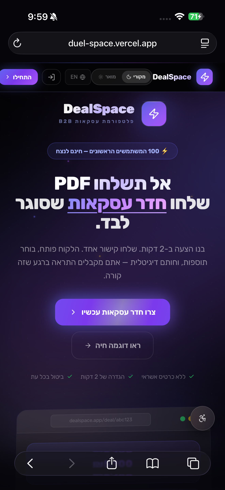
<p align="center"><sub><b>Hero section</b> — <i>"Don't send PDFs. Send a Deal Room that closes itself."</i> Bilingual He/En with Dynamic Island pill navbar, animated CTAs, and a "First 100 users — free forever" acquisition badge. Hebrew-first with full RTL support.</sub></p>
</td>
<td width="50%" valign="top">
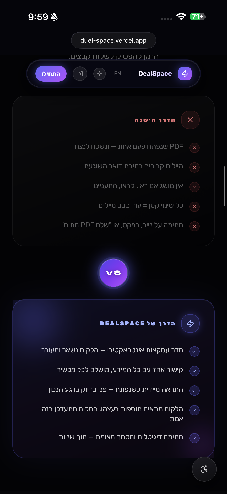
<p align="center"><sub><b>Problem vs Solution</b> — <i>"The Old Way"</i> (red X's: lost emails, unanswered proposals, static PDFs) vs <i>"The DealSpace Way"</i> (green checks: interactive Deal Rooms, live updates, legal digital signatures). Viewport-triggered reveal with staggered timing.</sub></p>
</td>
</tr>
</table>

### 📊 Smart Dashboard — CRM-Grade Analytics

<table>
<tr>
<td width="50%" valign="top">
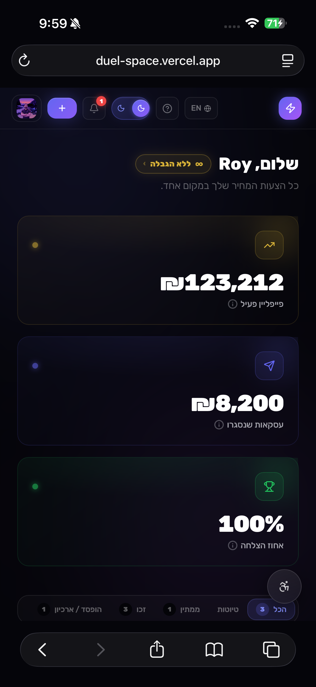
<p align="center"><sub><b>Personalized dashboard</b> — <i>"Hi Roy, all your pricing in one place"</i> with Premium <code>∞ ללא הגבלה</code> tier badge. Three spring-animated KPI cards: Active Pipeline (₪123,212), Closed Won (₪8,200), Win Rate (100%). Win Rate denominator excludes pending deals.</sub></p>
</td>
<td width="50%" valign="top">
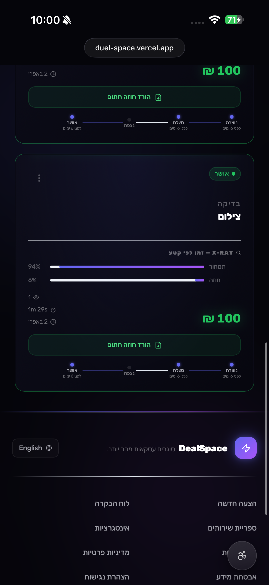
<p align="center"><sub><b>X-Ray section analytics</b> — Per-section time tracking on every accepted proposal (94% content, 6% contract, 1m 29s total). Full status timeline (Created → Sent → Viewed → Accepted) and one-click signed PDF download from the card itself.</sub></p>
</td>
</tr>
</table>

### 🎓 Guided Onboarding Tour — First-Run Spotlight

A 7-step interactive tour (driver.js with dual-theme overlay) walks new creators through the Dashboard the first time they land on it. Dismissible, one-time, persisted via <code>localStorage('dealspace:tour-completed')</code>.

<table>
<tr>
<td width="50%" valign="top">
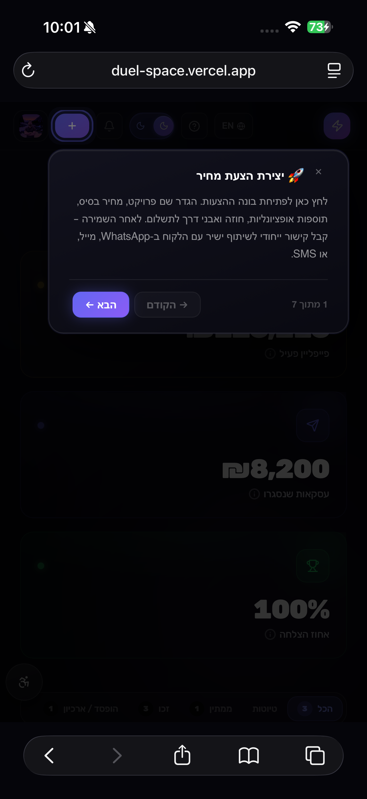
<p align="center"><sub><b>Step 1/7 — Create your proposal</b> 🚀<br/>Highlights the <code>+</code> CTA in the navbar. "Click to start building your proposal. Define a project name, base price, add-ons, contract, and payment milestones."</sub></p>
</td>
<td width="50%" valign="top">
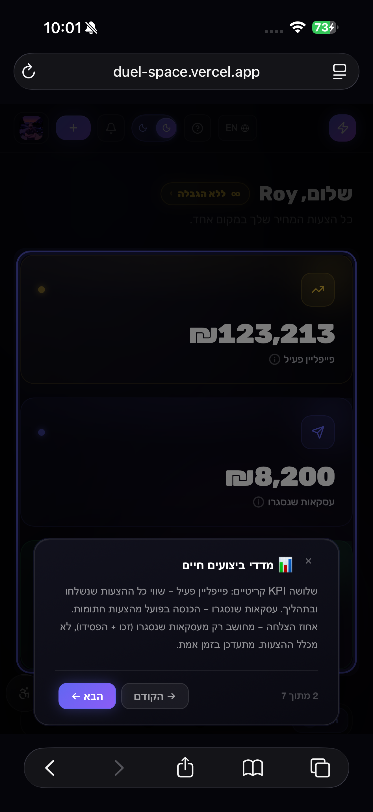
<p align="center"><sub><b>Step 2/7 — Live business KPIs</b> 📊<br/>Explains the 3 CRM cards: Active Pipeline (value of sent + viewed deals), Closed Won (signed revenue), Win Rate (resolved deals only).</sub></p>
</td>
</tr>
<tr>
<td width="50%" valign="top">
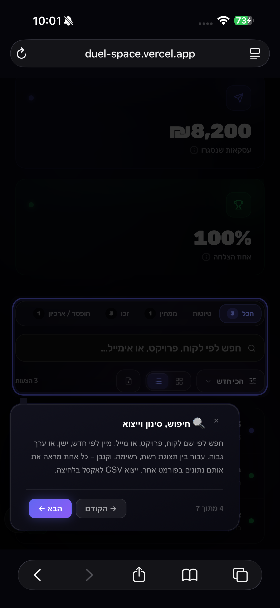
<p align="center"><sub><b>Step 4/7 — Search, filter & export</b> 🔍<br/>Filter tabs (All · Draft · Won · Archive), full-text search by client/project/email, sort by date or value, and one-click CSV export of the entire table.</sub></p>
</td>
<td width="50%" valign="top">
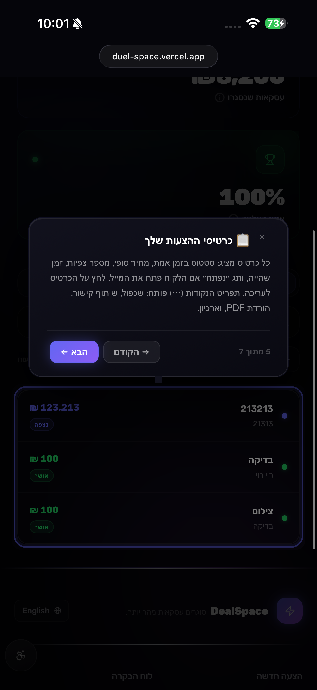
<p align="center"><sub><b>Step 5/7 — Your proposal cards</b> 💳<br/>Each card shows status, live price, client name, time spent, and a Radix dropdown with quick actions: share link, duplicate, PDF download, WhatsApp follow-up.</sub></p>
</td>
</tr>
</table>

### 🏠 Deal Room — Client-Facing Checkout Experience

<table>
<tr>
<td align="center">
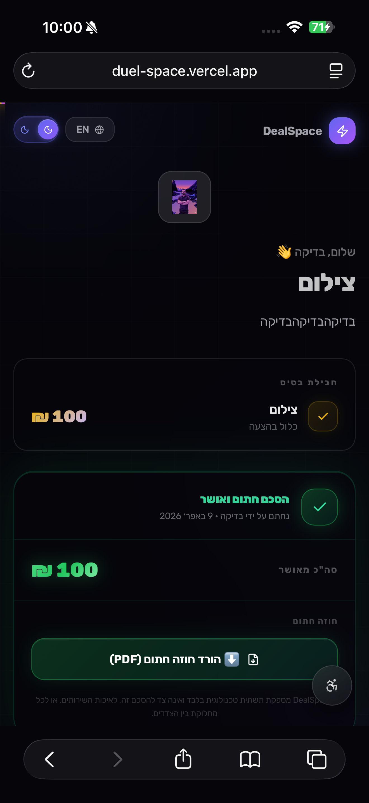
<br/>
<sub><b>Sealed deal state</b> — Once the client signs, the Deal Room locks into a neutral "summary" view: green <i>"הסכם חתום ואושר"</i> (Agreement Signed & Approved) card with signing date, final total, and a one-click <b>הורד חוזה חתום (PDF)</b> button. The business-owner can revisit this link any time without seeing the conversion UI again (via <code>freshSignedRef</code> guard).</sub>
</td>
</tr>
</table>

### 💼 Creator Tools — Services, Brand, Integrations

<table>
<tr>
<td width="50%" valign="top">
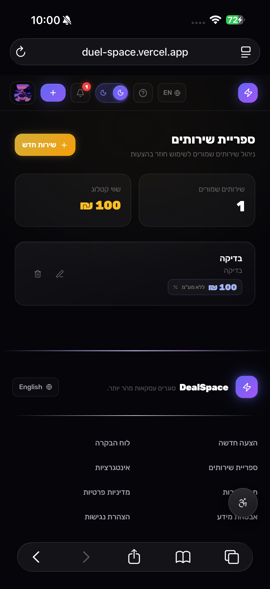
<p align="center"><sub><b>Services Library</b> (<code>/services</code>) — A Stripe-style Product Catalog for reusable services. Two stat cards (Catalog Value, Saved Services) plus CRUD-able service cards with pre-VAT pricing. One-click injection into any proposal via the ✨ Library button in the EditorPanel.</sub></p>
</td>
<td width="50%" valign="top">
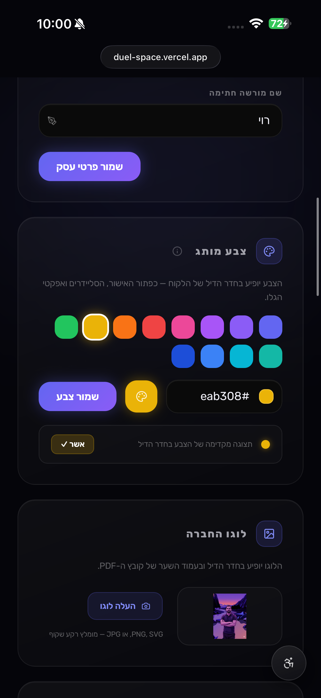
<p align="center"><sub><b>Brand identity</b> (<code>/profile</code>) — 12 preset brand-color swatches plus custom hex input and native color picker with live preview chip. Company logo upload to Supabase Storage auto-injects into every new proposal's Deal Room header and PDF cover page.</sub></p>
</td>
</tr>
<tr>
<td width="50%" valign="top">
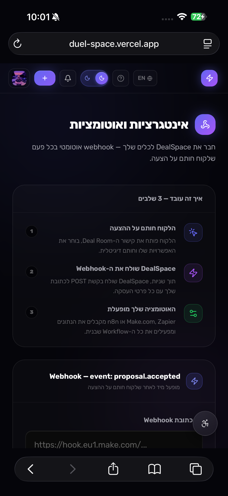
<p align="center"><sub><b>Integrations hub</b> (<code>/integrations</code>) — Configure a single webhook URL that fires on every signed deal. 3-step how-it-works explains: (1) client signs, (2) DealSpace POSTs event, (3) your automation runs. Live webhook event preview shows the exact <code>proposal.accepted</code> JSON payload.</sub></p>
</td>
<td width="50%" valign="top">
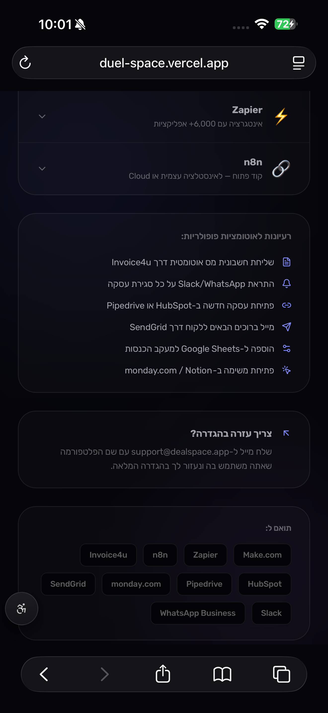
<p align="center"><sub><b>Platform library</b> — Out-of-the-box guides for Make.com, Zapier, and n8n with 8-step walkthroughs each. Automation recipes include: auto-invoicing via Invoice4u, WhatsApp/Slack alerts, HubSpot/Pipedrive deal creation, SendGrid onboarding emails, Google Sheets logging, monday.com/Notion task creation.</sub></p>
</td>
</tr>
</table>

### 💳 Billing — True State-Machine Self-Serve

<table>
<tr>
<td align="center">
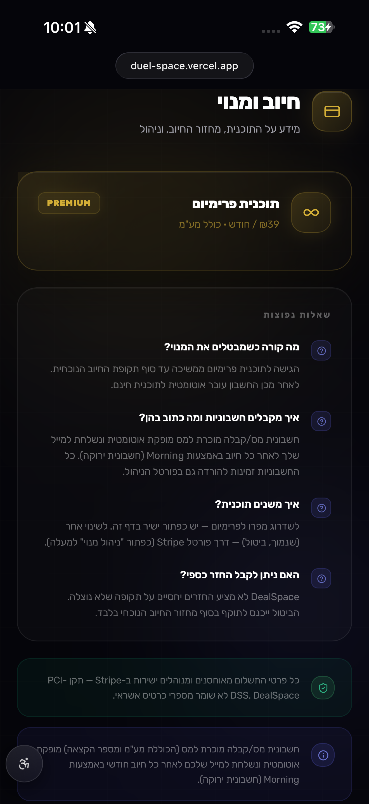
<br/>
<sub><b>Billing state machine</b> (<code>/billing</code>) — Four distinct UI states drive the page: <b>A</b> Free (upgrade cards), <b>B</b> Active (4-button action center: manage / payment method / invoices / cancel), <b>C</b> Cancel-at-period-end (amber reactivate banner), <b>D</b> Past-due (red update-payment banner). Built-in FAQ explains no-proration refund policy, Israeli Morning/חשבונית ירוקה tax-invoice compliance, and PCI-DSS security via Stripe. All portal actions generate <b>one-time dynamic sessions</b> via <code>createPortalSession()</code> — never static links.</sub>
</td>
</tr>
</table>

### ♿ Accessibility Widget — WCAG 2.2 AA · IS 5568

<table>
<tr>
<td width="50%" valign="top">
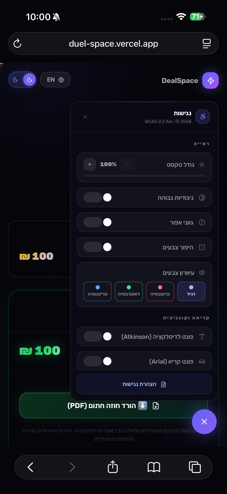
<p align="center"><sub><b>14-state accessibility engine</b> — Text scaling (1.0×–1.5×), high contrast, monochrome, color inversion, 4 color-blind modes (normal · protanopia · deuteranopia · tritanopia), Atkinson Hyperlegible dyslexia font, Arial readable font, line-height boost, letter spacing, reading mask, stop animations, highlight links, focus rings, big cursor. All states persisted to <code>localStorage('ds:a11y:*')</code> and re-applied on boot. IS 5568 (Israeli) and WCAG 2.2 AA compliant.</sub></p>
</td>
<td width="50%" valign="top">
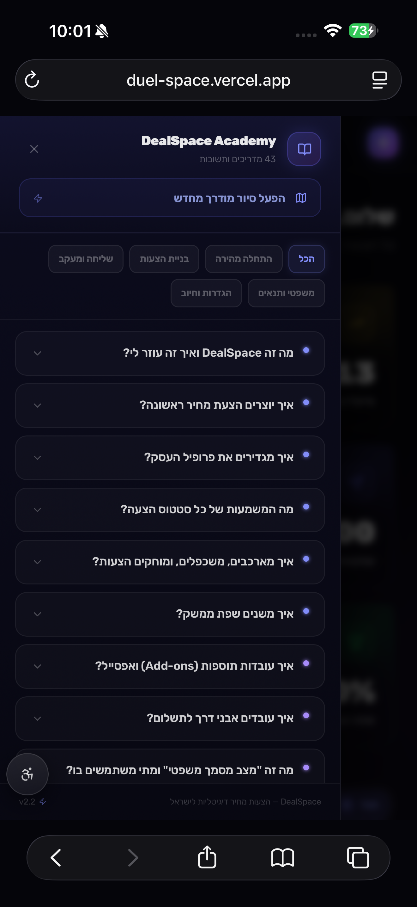
<p align="center"><sub><b>DealSpace Academy</b> — 44 bilingual FAQ items across 5 categories (Getting Started · Building Proposals · Sending & Tracking · Legal & Terms · Settings & Billing). Side drawer with search, category filter, and re-launchable guided tour. Every answer verified against the live codebase — no dead features or wrong quota figures.</sub></p>
</td>
</tr>
</table>

> **📁 Where are the image files?** Screenshots referenced above live in <code>docs/screenshots/*.png</code>. Add the 16 PNGs to that folder to make them render on GitHub.

---

## ✨ Feature Highlights

<table>
<tr>
<td width="50%">

### 📋 Proposal Builder
Split-screen editor with live preview. Drag-to-reorder add-ons (Framer Motion Reorder), payment milestone scheduling, access code gate, Quick-Start Templates for bilingual descriptions, and document-only mode (pure e-signing, no financials). Autosaves every 1500ms.

</td>
<td width="50%">

### 🏠 Interactive Deal Room
Fully public, zero-auth client page. Brand-color + logo injection via CSS variables, premium slider add-on cards, animated milestone timeline, legal identity capture, business terms consent, expiry lock with blur overlay, and a native canvas signature pad.

</td>
</tr>
<tr>
<td width="50%">

### 📄 Enterprise PDF Engine
Up to 4 pages: **Cover** → **Auto-paginated Content** → **Business Terms** (if set) → **Signature Certificate**. DocuSign-style forensic audit trail with IP + UA capture, brand-color injection, Heebo Hebrew typography, TipTap HTML parsing. Iron Grid architecture for bulletproof Hebrew/Latin Bidi layout.

</td>
<td width="50%">

### 💳 Stripe Revenue Engine
Full self-serve billing: Free / Pro (₪19/mo) / Premium (₪39/mo). Stripe Checkout for first purchase, Customer Portal for manage/cancel/update payment. Dunning UI for past-due payments. Webhook handler syncs `plan_tier`, `billing_status`, `subscription_period_end`, and `cancel_at_period_end` to Supabase user metadata.

</td>
</tr>
<tr>
<td width="50%">

### 🔗 Webhook Automation Engine
Pro+ users configure a webhook URL that fires on every accepted deal. Compatible with Make.com, Zapier, n8n, HubSpot, Pipedrive, Slack, and any HTTP endpoint. Step-by-step bilingual platform guides built in. Payload includes deal metadata, client identity, grand total, and currency.

</td>
<td width="50%">

### 📧 Native Email Delivery
Send branded RTL HTML proposals directly from the app via Resend. Tracks `email_sent_at`, `delivery_email`, and `email_opened_at` (read receipt). "Opened" badge appears on the Dashboard card. Deal Room pings `mark_email_opened` RPC on `?source=email` visits.

</td>
</tr>
<tr>
<td width="50%">

### 📊 Smart Dashboard
CRM-grade KPI grid (active pipeline, closed won revenue, win rate from resolved deals only), grid + list + kanban views, search + filter + sort bar, CSV export, animated spring counters, optimistic UI updates, guided onboarding tour, and multi-select bulk delete for archived proposals.

</td>
<td width="50%">

### 🛡️ Admin Panel
Founder-only (`/admin`) user registry with KPI cards, tier badges, pipeline values, and per-user ops drawer (Radix Tabs). Profile edit, tier override, bonus quota, suspend/unsuspend, admin notes, proposal history, and one-click impersonation via magic link Edge Function.

</td>
</tr>
<tr>
<td width="50%">

### 🏛️ Global Business Terms
Creators write their legal terms once in a TipTap rich-text editor (Profile page). Terms auto-inject into every new proposal. Clients see a dedicated Terms section in the Deal Room (visible even after signing) and must check a consent checkbox before signing. Terms appear on a dedicated PDF page.

</td>
<td width="50%">

### ♿ Accessibility Engine
14-state a11y widget: text scaling (1.0–1.5×), high contrast, monochrome, invert colors, 3 color-blind modes, dyslexia font (Atkinson Hyperlegible), reading mask, stop animations, link highlights, focus rings, big cursor. IS 5568 + WCAG 2.2 AA compliant. Persisted to localStorage.

</td>
</tr>
<tr>
<td width="50%">

### 🔄 Smart Contract Variables
Template engine (`contractEngine.ts`) replaces `{Variable_Name}` tags in descriptions with live proposal values — `{Client_Name}`, `{Grand_Total}`, `{Date_Today}`, `{Company_Name}`, and more. Unrecognised tags are preserved verbatim (safe, no data loss).

</td>
<td width="50%">

### 👁️ Live Presence Tracking
Real-time viewer detection via Supabase Realtime channels. A single WebSocket per creator tracks all proposals. Dashboard cards show a live "viewing now" indicator when a client has the Deal Room open.

</td>
</tr>
</table>

---

## 🏗️ Tech Stack

| Layer | Technology | Version | Notes |
|---|---|---|---|
| **Build** | Vite | ^8.0 | HMR, tree-shaking, route-based code splitting |
| **UI** | React | ^19.2 | No class components, no StrictMode (FM v12 bug) |
| **Language** | TypeScript | ~5.9 strict | `tsc -b` must pass before every commit |
| **Styling** | Tailwind CSS | ^3.4 | Utility-first, dual light/dark theme via `dark:` modifier |
| **Animation** | Framer Motion | ^12.38 | CSS keyframes for first-render, FM for transitions |
| **Smooth Scroll** | Lenis | ^1.3.21 | `syncTouch: false` — prevents iOS FPS drops |
| **Routing** | react-router-dom | ^7.13 | PKCE-safe redirects, lazy page imports |
| **State** | Zustand | ^5.0 | Auth, proposals, services, a11y — no Redux |
| **Backend** | Supabase | ^2.100 | Postgres + Auth + Storage + RPCs + Edge Functions |
| **Payments** | Stripe | — | Checkout, Customer Portal, webhooks |
| **Email** | Resend | — | Branded RTL HTML via Edge Function |
| **PDF** | @react-pdf/renderer | ^4.3 | 4-page enterprise output, Heebo font, Iron Grid |
| **Rich Text** | TipTap | ^2.x | Business terms editor, proposal description |
| **Tour** | driver.js | — | Dual-theme guided onboarding tour |
| **Icons** | Lucide React | ^1.7 | — |
| **Confetti** | canvas-confetti | ^1.x | Fires on deal acceptance |
| **Deployment** | Vercel | — | Auto-deploy from `main` |

> **Removed:** `react-signature-canvas` → native canvas (`quadraticCurveTo` + pointer events). `ContractLibrary` + `contractTemplates.ts` → replaced by Global Business Terms in Profile. `ThemeProvider forcedTheme="dark"` → full dual light/dark mode.

---

## 📁 Project Structure

```
src/
├── pages/
│   ├── LandingPage.tsx            # / — bilingual marketing, dual theme, spinning pricing
│   ├── Auth.tsx                   # /auth — Linear.app style, glass card
│   ├── AuthCallback.tsx           # /auth/callback — PKCE redirect handler
│   ├── ResetPassword.tsx          # /auth/reset-password — PASSWORD_RECOVERY flow
│   ├── Dashboard.tsx              # /dashboard — KPIs, grid/list/kanban, dunning banner
│   ├── ProposalBuilder.tsx        # /proposals/new|:id — split-screen editor
│   ├── DealRoom.tsx               # /deal/:token — fully public client flow
│   ├── Profile.tsx                # /profile — avatar, biz info, brand color, logo, terms, VAT
│   ├── ServicesLibrary.tsx        # /services — reusable service definitions CRUD
│   ├── Integrations.tsx           # /integrations — webhook automations hub
│   ├── Billing.tsx                # /billing — state-machine billing (Free/Active/Canceled/Past-due)
│   ├── Legal.tsx                  # /security — security policy
│   ├── TermsOfService.tsx         # /terms — 12-clause bilingual ToS
│   ├── PrivacyPolicy.tsx          # /privacy — 12-clause bilingual policy
│   ├── AccessibilityStatement.tsx # /accessibility — WCAG 2.2 AA + IS 5568
│   ├── ImpersonateCallback.tsx   # /impersonate — admin magic-link OTP landing
│   └── admin/
│       ├── AdminDashboard.tsx     # /admin — founder-only user registry
│       └── UserOpsDrawer.tsx      # Slide-over: Profile/Billing/Security/Danger tabs
│
├── components/
│   ├── builder/
│   │   ├── EditorPanel.tsx        # Collapsible sections, Quick-Start Templates, milestones
│   │   ├── LivePreview.tsx        # Real-time spring-animated preview
│   │   ├── AIGhostwriter.tsx      # Keyword-matched Quick-Start Templates (bilingual)
│   │   ├── RichTextEditor.tsx     # TipTap editor — dual theme, He/En
│   │   ├── ReusableServices.tsx   # Inject from services library into proposal
│   │   └── SendModal.tsx          # Share URL + email composer
│   ├── deal-room/
│   │   ├── PremiumSliderCard.tsx  # Toggle + range slider add-on, sealed state
│   │   ├── CheckoutClimax.tsx     # Sticky total, VAT breakdown, business terms consent, CTA
│   │   ├── SignaturePad.tsx       # Native canvas — DPR-scaled, quadraticCurveTo strokes
│   │   ├── ClientDetailsForm.tsx  # Legal identity capture (name, ח.פ, address, role)
│   │   └── MilestoneTimeline.tsx  # Animated payment schedule with spring amounts
│   ├── dashboard/
│   │   ├── ProposalCard.tsx       # Magnetic tilt, Radix dropdown, X-Ray analytics, timeline
│   │   ├── ProposalCardSkeleton.tsx
│   │   ├── KanbanBoard.tsx        # Status-grouped kanban view
│   │   └── BottomSheet.tsx        # Mobile action sheet
│   ├── layout/
│   │   ├── ProtectedLayout.tsx    # Navbar shell: tier badge, quota check, dunning lock, HelpCenter
│   │   ├── AdminRoute.tsx         # Three-layer auth guard for /admin
│   │   ├── ThemeProvider.tsx      # next-themes wrapper: dark default, system preference
│   │   └── AnalyticsProvider.tsx  # Route-change listener (gtag/fbq/posthog) — shell, not yet wired
│   ├── onboarding/
│   │   └── GuidedTour.tsx         # First-run single-step spotlight (dual theme)
│   └── ui/
│       ├── GlobalFooter.tsx       # Self-contained footer, dual mobile/desktop DOM
│       ├── AccessibilityWidget.tsx # Draggable FAB, 14 a11y controls, dual theme
│       ├── HelpCenterDrawer.tsx   # 44 bilingual FAQ items, 5 categories, dual theme
│       └── ThemeToggle.tsx        # Light/dark toggle in navbar
│
├── stores/
│   ├── useAuthStore.ts            # Auth lifecycle, PKCE, profile mutations
│   │                              # useTier() / useBillingStatus() / useSubscriptionPeriodEnd()
│   │                              # useCancelAtPeriodEnd() selectors
│   ├── useProposalStore.ts        # Optimistic CRUD, Realtime subscription, demo injection
│   ├── useServicesStore.ts        # Services catalog CRUD (Supabase-backed, optimistic)
│   ├── usePresenceStore.ts        # Live viewer tracking by public_token via Supabase Realtime
│   └── useAccessibilityStore.ts   # 14 a11y states, DOM mutations, localStorage persistence
│
├── lib/
│   ├── pdfEngine.tsx              # 4-page enterprise PDF, Iron Grid, TipTap HTML parser
│   ├── i18n.ts                    # He/En Zustand store, RTL/LTR switching
│   ├── stripe.ts                  # buildCheckoutUrl() + createPortalSession() helpers
│   ├── automations.ts             # triggerPostSignatureAutomations — webhook POST
│   ├── contractEngine.ts          # Smart variable replacement: {Client_Name}, {Grand_Total}, etc.
│   ├── tourEngine.ts              # driver.js dual-theme tour, 7 steps
│   ├── knowledgeBase.ts           # 44 bilingual FAQ items, 5 categories
│   ├── successTemplates.ts        # Post-signature screen variant definitions
│   ├── financialMath.ts           # Israeli gross-price VAT model, rounding, milestones
│   └── passwordValidation.ts      # Strength scoring (score 1–4, color, label)
│
├── types/
│   └── proposal.ts                # Proposal, ProposalInsert, AddOn, PaymentMilestone,
│                                  # CreatorInfo, proposalTotal(), STATUS_META, PlanTier,
│                                  # BillingStatus
│
└── App.tsx                        # React.lazy routes, Suspense, ProtectedRoute, AdminRoute

supabase/
├── migrations/                    # 33 migrations — full schema history
└── functions/
    ├── admin-impersonate/         # Generate magic link for founder impersonation
    ├── send-proposal/             # Branded RTL email via Resend (--no-verify-jwt)
    ├── stripe-portal/             # One-time Customer Portal session URL
    └── stripe-webhook/            # Stripe event handler → user_metadata sync
```

---

## 🗄️ Database (Supabase / PostgreSQL)

### `proposals` table — full column set

| Column | Type | Notes |
|---|---|---|
| `id` | uuid PK | `gen_random_uuid()` |
| `user_id` | uuid FK | → `auth.users`, cascade delete |
| `client_name / email / company_name / tax_id / address / signer_role` | text | Legal identity — captured at signing via `save_client_details` RPC |
| `project_title` | text | Required for "Send" |
| `description` | text | TipTap HTML |
| `base_price` | numeric(12,2) | Core service price (always gross/VAT-inclusive) |
| `add_ons` | jsonb `AddOn[]` | `{ id, label, description, price, enabled, clientAdjustable }` |
| `payment_milestones` | jsonb `PaymentMilestone[]` | Must sum to 100% when non-empty |
| `include_vat` | boolean | עוסק מורשה — extract VAT from within gross prices |
| `prices_include_vat` | boolean | Schema column, reserved for future use |
| `currency` | text | `ILS` default |
| `status` | enum | `draft → sent → viewed → accepted / rejected / needs_revision` |
| `public_token` | text unique | Deal Room URL key (hex 16 bytes) |
| `access_code` | text | Optional 4-digit PIN gate |
| `brand_color` | text | Hex — CSS var injection in Deal Room + PDF |
| `creator_info` | jsonb `CreatorInfo` | Auto-injected from `user_metadata` by EditorPanel on every save |
| `business_terms` | text | TipTap HTML — frozen from `user_metadata.business_terms` at save time |
| `expires_at` | timestamptz | Proposal expiry — blur lock + red banner in Deal Room when past |
| `display_bsd` | boolean | Show בס"ד marker (Israeli market) |
| `hide_grand_total` | boolean | Hide total from client — "menu-style" proposals |
| `is_document_only` | boolean | Strip all financial blocks — pure e-signing mode |
| `is_archived` | boolean | Soft delete — moves to Archive tab |
| `signature_data_url` | text | PNG data URL of client's drawn signature |
| `signer_ip` | text | Client IP captured at signing (forensic audit) |
| `signer_user_agent` | text | Client browser UA captured at signing |
| `delivery_email` | text | Email address last sent to |
| `email_sent_at` | timestamptz | Timestamp of last email send |
| `email_opened_at` | timestamptz | First email open (set by `mark_email_opened`) |
| `view_count / last_viewed_at / time_spent_seconds` | — | Engagement analytics |
| `sent_at / accepted_at` | timestamptz | Status transition timestamps |
| `created_at / updated_at` | timestamptz | `updated_at` auto-managed by trigger |

### `services` table

| Column | Type | Notes |
|---|---|---|
| `id` | uuid PK | |
| `user_id` | uuid FK | Owner-only RLS |
| `label` | text | Service name |
| `description` | text | nullable |
| `price` | numeric(12,2) | Pre-VAT price |

### RPC Functions

All `SECURITY DEFINER, SET search_path = public`:

```sql
-- Public Deal Room RPCs (anon + authenticated)
get_deal_room_proposal(p_token, p_code DEFAULT NULL)
  -- Returns full proposal JSON, {"_requires_code": true}, or NULL
  -- Strips webhook_url from creator_info before returning (security)

mark_proposal_viewed(p_token)
accept_proposal(p_token, p_ip, p_ua, p_sig, p_add_ons)
  -- Blocked when client_name IS NULL or empty (migration 32)
  -- Returns BOOLEAN: true = accepted, false = blocked/not found
save_client_details(p_token, p_full_name, p_company_name, p_tax_id, p_address, p_signer_role)
update_proposal_time_spent(p_token, p_seconds)
mark_email_opened(p_token)   -- idempotent, sets email_opened_at once

-- Admin RPCs (roychen651@gmail.com only)
get_admin_users_data()
admin_set_user_tier(p_target_id, p_tier)
admin_update_user_advanced(p_target_id, p_name, p_company, p_bonus_quota)
admin_toggle_suspend(p_target_id, p_suspend)
admin_save_note(p_target_id, p_note)
admin_get_user_proposals(p_target_id)
admin_delete_user(p_target_id)
```

> ⚠️ Every RPC **must** include `SET search_path = public`. Without it, the anon execution context cannot resolve the `proposals` table.

---

## 💳 Stripe & Billing

### Plan Tiers

| Internal value | Display | Price | Quota |
|---|---|---|---|
| `'free'` | Free | ₪0/mo | 5 proposals/month |
| `'pro'` | Pro | ₪19/mo | 100 proposals/month |
| `'unlimited'` | Premium | ₪39/mo | Unlimited |

> The internal `'unlimited'` value is kept for backward compatibility. Display name is "Premium".

### user_metadata fields (written by `stripe-webhook` only)

```
plan_tier                         'free' | 'pro' | 'unlimited'
billing_status                    'active' | 'past_due' | 'canceled' | null
stripe_customer_id                string
subscription_period_end           Unix timestamp string (×1000 for Date)
subscription_cancel_at_period_end 'true' | 'false'
```

### Routing rule

```
stripe_customer_id EXISTS  →  createPortalSession()   (existing customer → portal)
stripe_customer_id MISSING →  buildCheckoutUrl()      (first purchase → checkout)
```

### Edge Functions

| Function | Purpose | Deploy flag |
|---|---|---|
| `stripe-webhook` | Stripe event → `user_metadata` sync | default |
| `stripe-portal` | One-time Customer Portal session URL | default |
| `send-proposal` | Branded RTL email via Resend | `--no-verify-jwt` |
| `admin-impersonate` | Magic link for founder impersonation | default |

---

## 📄 PDF Engine — Page Structure

```
┌─────────────────────────────────────┐
│  PAGE 1 — COVER                     │
│  ██████ brand_color hero ██████     │
│     [Company Logo] or initials      │
│     Company Name                    │
│     PROPOSAL & SERVICE AGREEMENT    │
│                                     │
│     Project Title                   │
│     PREPARED FOR: Client Name       │
│     Date  ·  Document ID            │
├─────────────────────────────────────┤
│  PAGES 2+ — MAIN CONTENT (auto)     │
│  Fixed header: Company · Project · Page X/Y
│                                     │
│  PARTIES — Iron Grid label/value    │
│  DESCRIPTION — TipTap HTML parsed   │
│  SERVICES & PRICING — brand table   │
│  Of which VAT (18%): ₪XXX          │
│  ┌─ Grand Total ─────────────────┐  │
│  PAYMENT MILESTONES — brand table   │
│  Fixed footer: DealSpace · token    │
├─────────────────────────────────────┤
│  PAGE 3 — BUSINESS TERMS (if set)  │
│  (conditional — only when non-empty)│
│  Creator's TipTap HTML terms        │
├─────────────────────────────────────┤
│  LAST PAGE — SIGNATURE CERTIFICATE  │
│  ██████ ✓ brand_color hero ██████  │
│  [Signature PNG]                    │
│  Signer · Role · Date · Time        │
│  IP Address · Device/Browser        │
│  ╔══ DOCUMENT TOKEN ══╗             │
│  ── AUDIT TRAIL (8 rows) ──         │
│  e-Signature Law 5761-2001 notice   │
└─────────────────────────────────────┘
```

**Iron Grid Architecture:** All label/value pairs use `flexDirection: 'row-reverse'` with fixed-width `<View>` wrappers (never bare `<Text>`). This creates hard Bidi boundaries that prevent Hebrew/Latin character scrambling in react-pdf's LTR rendering context.

**Israeli VAT model:** Prices are always entered as gross (VAT-inclusive). The engine extracts VAT from within using `netFromGross(gross, 0.18)`. Never adds VAT on top.

---

## 🚀 Getting Started

### Prerequisites

- Node.js 18+
- Supabase project (free tier works)
- Supabase CLI: `brew install supabase/tap/supabase`
- Stripe account (for billing features)

### 1. Clone & Install

```bash
git clone https://github.com/Roychen651/DuelSpace.git
cd DuelSpace
npm install
```

### 2. Environment Variables

Create `.env.local` in the project root:

```env
# Browser-safe (VITE_ prefix required)
VITE_SUPABASE_URL=https://your-project-ref.supabase.co
VITE_SUPABASE_ANON_KEY=eyJhbGciOiJIUzI1NiIsInR5cCI6IkpXVCJ9...
VITE_APP_URL=http://localhost:5173

# Stripe Payment Links (first-time buyers)
VITE_STRIPE_PRO_LINK=https://buy.stripe.com/...
VITE_STRIPE_PREMIUM_LINK=https://buy.stripe.com/...
VITE_STRIPE_CUSTOMER_PORTAL=https://billing.stripe.com/p/login/...  # legacy fallback

# Server-only — NEVER expose to browser
SUPABASE_SERVICE_ROLE_KEY=eyJ...
SUPABASE_ACCESS_TOKEN=sbp_...    # Supabase PAT for running migrations
```

> 🔒 `.env.local` is gitignored. **Never commit it.**

### 3. Supabase Edge Function Secrets

Set in Supabase Dashboard → Edge Functions → Secrets:

```
RESEND_API_KEY=re_...
APP_URL=https://duel-space.vercel.app
STRIPE_SECRET_KEY=sk_live_...
STRIPE_WEBHOOK_SECRET=whsec_...
STRIPE_PRICE_PRO=price_...
STRIPE_PRICE_PREMIUM=price_...
```

### 4. Link Supabase & Run Migrations

```bash
# Link once
supabase link --project-ref your-project-ref

# Apply all 33 migrations
npm run migrate

# If a migration was applied manually outside CLI:
supabase migration repair --status applied <timestamp>
```

### 5. Deploy Edge Functions

```bash
supabase functions deploy stripe-webhook  --project-ref your-project-ref
supabase functions deploy stripe-portal   --project-ref your-project-ref
supabase functions deploy admin-impersonate --project-ref your-project-ref
supabase functions deploy send-proposal   --project-ref your-project-ref --no-verify-jwt
```

### 6. Start Dev Server

```bash
npm run dev
# → http://localhost:5173
```

### 7. Type-Check & Build

```bash
npx tsc -b           # MUST be clean — matches CI
npm run build        # tsc -b + vite build
npm run lint         # ESLint
```

---

## 🔐 Auth Flow

```
Sign Up / Sign In (PKCE)
  Auth.tsx  →  Supabase PKCE  →  /auth/callback  →  /dashboard

Password Reset
  sendPasswordResetEmail()  →  /auth/reset-password
  → onAuthStateChange: PASSWORD_RECOVERY  →  sessionReady = true
  → updatePassword(newPassword)

Admin Impersonation (founder only)
  /admin  →  admin-impersonate Edge Function
  → supabaseAdmin.auth.admin.generateLink({ type: 'magiclink' })
  → window.open(magic_link, '_blank')  →  /impersonate?email=...&otp=...
  → ImpersonateCallback.tsx verifyOtp  →  /dashboard
```

Auth status lifecycle: `idle → loading → authenticated | unauthenticated`

---

## 🌍 i18n — Zero Language Bleed

**Default locale: Hebrew (RTL).** Persisted in `localStorage('dealspace:locale')`.

```ts
const { locale, dir, t, setLocale } = useI18n()

t('auth.tab.signin')    // → 'כניסה' | 'Sign In'
setLocale('en')          // flips locale, RTL/LTR, document.documentElement
```

**Hard requirement:** Every UI string must have both `he` and `en` variants. Hebrew UI must never show English words. English UI must never show Hebrew characters or `₪`. Prices in the English UI always use `₪` — DealSpace operates exclusively in the Israeli market.

**Hebrew Bidi period rule:** Never place a trailing period directly after a Latin word in Hebrew text (e.g., `'שלחו PDF.'`). The period adjacent to Latin characters takes LTR direction and renders at the wrong visual position.

---

## 🎨 Theming

DealSpace ships full **dual light/dark mode** via Tailwind's `dark:` modifier and CSS custom properties:

```css
/* Light mode tokens */
--bg-base:      #f8fafc;
--bg-card:      #ffffff;
--border-glass: rgba(15, 23, 42, 0.12);
--text-main:    #0f172a;
--text-muted:   #64748b;

/* Dark mode tokens (.dark) */
--bg-base:      #030305;
--bg-card:      rgba(255, 255, 255, 0.02);
--border-glass: rgba(255, 255, 255, 0.08);
--text-main:    #ffffff;
--text-muted:   rgba(255, 255, 255, 0.4);
```

Always use `dark:` prefixed Tailwind utilities or `var(--token)` for dual-mode elements. Never hardcode dark hex colors without a `dark:` counterpart.

---

## 📦 localStorage Keys

| Key | Value | Owner |
|---|---|---|
| `dealspace:locale` | `'he' \| 'en'` | i18n store |
| `dealspace:vat-rate` | decimal string `'0.18'` | Profile.tsx |
| `dealspace:view-mode` | `'grid' \| 'list' \| 'kanban'` | Dashboard.tsx |
| `dealspace:demo-injected` | `'true'` | useProposalStore |
| `dealspace:tour-completed` | `'true'` | GuidedTour.tsx |
| `ds:a11y:*` | various | useAccessibilityStore (14 keys) |

---

## 🚢 Deployment (Vercel)

Pushes to `main` auto-deploy via Vercel webhook.

```bash
# Standard workflow
npx tsc -b                      # clean check
git add src/specific-file.tsx   # never git add -A
git commit -m "feat: ..."
git push origin main            # triggers Vercel
```

**Vercel "Redeploy" gotcha:** The Redeploy button replays the same commit SHA. If you've pushed a fix but Vercel is still failing on the old commit:

```bash
git commit --allow-empty -m "chore: force Vercel redeploy"
git push origin main
```

---

## ⚠️ Critical Rules

| ❌ Never | ✅ Instead |
|---|---|
| Add `<React.StrictMode>` | Leave bare `<App />` — FM v12 double-invoke bug |
| `transition={{ ease: [0.22, 1, 0.36, 1] }}` | `transition={{ ease: 'easeOut' as const }}` |
| Omit `payment_milestones: []` from `ProposalInsert` | Required field — breaks `tsc -b` |
| Write RPC without `SET search_path = public` | Always include — anon context needs it |
| Auth-guard `/deal/:token` | It's the public client URL |
| `git add -A` | Stage specific files explicitly |
| Add VAT on top of entered prices | Extract with `netFromGross()` — Israeli gross-price model |
| Replace Realtime UPDATE `newRow` in-place | Call `fetchProposals()` — payload omits JSONB columns |
| Send existing customers to a Checkout link | Use `createPortalSession()` — prevents duplicate subscriptions |
| Call `deleteAccount()` expecting `{ error }` | Wrap in `try/catch` — it returns `Promise<void>` |
| Use `background:` shorthand with Tailwind `bg-*` | Use `backgroundImage:` — shorthand resets `background-color` |
| Deploy `send-proposal` without `--no-verify-jwt` | Gateway rejects the JWT before function code runs |
| Use `breakBefore: 'page'` in react-pdf styles | Use `<View break>` JSX prop instead |
| Hardcode dark colors without `dark:` counterpart | Always pair with `dark:` Tailwind modifier |

---

## 🔍 Launch Hardening — Sprints 75–78

Four sprints of systematic audit + fix cycles took the codebase from "feature-complete" to "launch-ready." All pre-launch blockers resolved and shipped to production.

### Sprint 75 — God-Mode System Audit (Read-Only)
Comprehensive 360° codebase audit across 5 lenses. Identified 3 critical pre-launch blockers:

| Grade | Lens |
|---|---|
| **B+** | Design / UI / UX — Awwwards-level dark mode, solid light mode |
| **B** | Architecture / Performance — Route-split lazy loading, ~135KB vendor chunk |
| **B−** | Security / Auth / Database — RLS policy needs tightening |
| **B** | Product / Features / Billing — Complete lifecycle |
| **D** | Analytics / Telemetry — Provider shell exists, no scripts wired |

### Sprint 76 — Critical Security & Quota Hotfix (Migration 34 — deployed live)

| Fix | What changed |
|---|---|
| **F1 — RLS data leak sealed** | `public_token_select` policy changed from `USING (public_token IS NOT NULL)` (effectively an anonymous blanket read) to `USING (false)`. Public Deal Room access now works **exclusively** through the `get_deal_room_proposal` SECURITY DEFINER RPC. |
| **F2 — Pro tier quota enforced** | `check_proposal_quota()` trigger function upgraded via `CREATE OR REPLACE` to enforce all tiers: `free` = 5 + bonus, `pro` = 100 + bonus, `unlimited` = no cap. Counts proposals created since `date_trunc('month', now())`. |

### Sprint 77 — Pre-Launch Audit (Read-Only)
Second 360° audit across 6 lenses. Verdict: **Conditional Pass — 5 showstoppers remaining (F1–F5)**.

### Sprint 78 — Launch-Day Hotfixes (All 5 shipped — commit `dd69d07`)

| # | Fix | File(s) |
|---|---|---|
| **F1** | Full bilingual no-proration refund statement on the Billing cancel button | `src/pages/Billing.tsx` |
| **F2** | ToS clause 8 extended with explicit sub-clause (c): monthly renewals are final and non-refundable once a new billing period commences | `src/pages/TermsOfService.tsx` |
| **F3** | `new URL()` parse + `http:`/`https:` protocol whitelist before any webhook `fetch()` call — blocks `javascript:`, `file://`, and other injection vectors | `src/lib/automations.ts` |
| **F4** | `maxLength` added to all DB-bound text inputs: project title / client fields (200), add-on labels (150), `ClientDetailsForm` fields (200 each) | `EditorPanel.tsx`, `ClientDetailsForm.tsx` |
| **F5** | PostHog no-op stub injected into `index.html` — prevents `AnalyticsProvider` from throwing on undefined globals. Replace with real key when ready. | `index.html` |

**Verdict after Sprint 78:** ✅ **Full launch clearance granted.**

---

## 🤝 Contributing

This is a private commercial project. Contact [Roy Chen](https://github.com/Roychen651) for collaboration.

---

<div align="center">

**© 2026 DealSpace Technologies Ltd. All rights reserved.**

Built with ⚡ in Tel Aviv · Powered by [DealSpace](https://duel-space.vercel.app)

</div>
